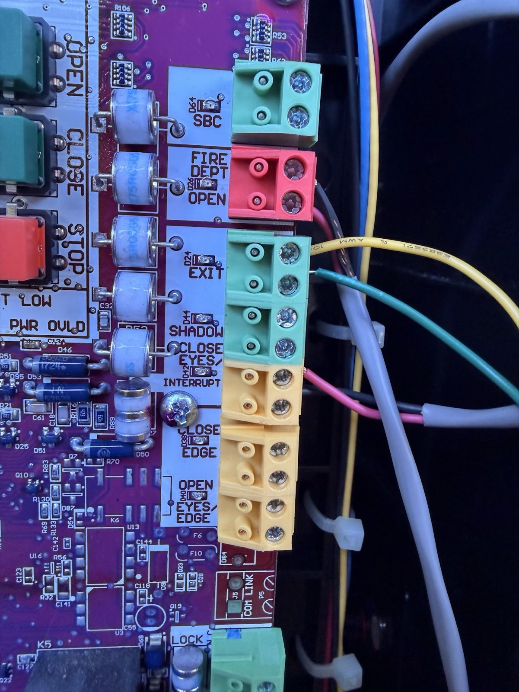

# Gate Controller

Secure, timed gate control using a Seeed Studio XIAO ESP32-S3 running
CircuitPython and a Firebase web app.

The [Drawbridge mobile app](https://drawbridge-45487.firebaseapp.com) uses Google
sign-in to send timed MQTT holds: 1m, 15m, 1h, 6h, or End hold. Connection
secrets stay in Firebase; each user sees their assigned gates. See the
[web app guide](firebase/README.md) for access administration, testing,
and deployment. Use `make web-test-unit` for quick checks, `make web-test`
for the full local suite, and `make web-deploy` to test and deploy Firebase.
`make web-test-mqtt` checks the live broker on a synthetic topic.

Per-device MQTT credentials are a planned hardening step. See the
[per-device credentials plan](docs/per-device-mqtt-credentials.md).
Administrators can manage roles and per-device OTA targets through the profile
menu's **Administration** view. Nick is the initial owner. See
[OTA operations](docs/ota-operations.md) for opt-in enrollment, GitHub releases,
USB recovery, and the required bench verification before field use.

The XIAO ESP32S3 CircuitPython app provides Wi-Fi provisioning, MQTT, and
connection/hold indicators. See [circuitpython/README.md](circuitpython/README.md)
for setup, deployment, and hardware verification. Host dependencies are
managed with `uv`; use `make setup`, `make test`, and `make deploy` from the
repository root.

Install the repository checks once, then let pre-commit run them on each commit:

```sh
make precommit-install
make precommit       # run against every tracked file
```

The hooks detect private keys and likely secrets, validate JSON/XML, catch
merge conflicts and whitespace errors, and run Ruff linting/formatting. Use
`make lint` for the Python-only Ruff check. Secret files such as `.env` and
`emqxsl-ca.crt` are ignored by Git and excluded from scanning.

The current bench firmware holds D10/GPIO9 LOW at startup. A hold message raises
D10 steadily for the requested duration. D2/GPIO3 blinks four times per second
while holding and is otherwise off. D0/GPIO1 indicates Wi-Fi; D1/GPIO2 indicates
MQTT readiness. The onboard LED pulses every two seconds to show the loop is
running. Each external LED needs its own 1 kΩ series resistor and ground return.
The temporary startup check flashes all three external LEDs three times.
D9 is unused. The diagrams below predate the four-LED assignment; see
[firmware LED wiring](circuitpython/README.md) for the current pin roles.
See the [connection guide](docs/xiao-breadboard.svg) and the
[170-hole mini breadboard layout](docs/xiao-breadboard.md), including the
Fritzing project and exact hole assignments. The transistor collector
LED is a disconnected bench load; the prospective LiftMaster eyes interface
has not been validated. Current firmware ignores legacy MQTT blink commands.
The installed wiring is documented in [this field photo](docs/wiring-installed.jpg).

The LiftMaster controller's EXIT terminal pair and its current yellow/green
wiring are shown below. Use this as a visual record of the installation; it
does not establish the terminal's electrical interface or ratings.



## Hardware

The current PCB is the [Drawbridge FeatherWing](hardware/featherwing/README.md),
50.8 × 22.86 mm, two layers, 1.6 mm thick. It fits above a Feather using underside
headers. J3 is a top-side 2.54 mm screw terminal for OUT_OC and GND, facing away
from USB. The transistor stage uses a 2N3904, 1 kΩ base resistor, and 100 kΩ
pulldown; each white/blue/green status LED has its own 1 kΩ resistor.

See [the generated BOM](hardware/featherwing/bom.csv) for exact parts and
[circuitpython/README.md](circuitpython/README.md) for the XIAO firmware wiring.
Older files at the root of `hardware/` are reference designs, not this board.

Commit all changes, then generate the fabrication package with `make featherwing-fab`.
The build requires a clean checkout; revisions use the first three HEAD characters,
and each ZIP records the full commit hash.
Use the freshly generated files in `artifacts/featherwing/`; the
[upload guide](hardware/featherwing/README.md#pcbway-upload) maps each file to its
PCBWay or Seeed upload field.
